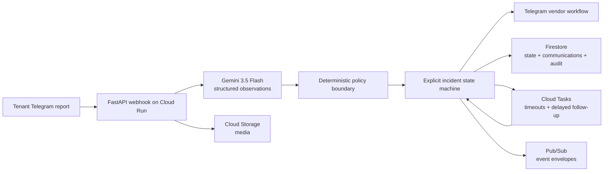

# No More Buckets

No More Buckets is an autonomous repair coordinator for small landlords and property managers. A tenant reports a leak through Telegram with text, a photo, video, or a voice note. The system assesses the report, sends safe containment instructions, creates a bounded work order, contacts vendors, tracks the repair, checks completion evidence, and asks the tenant to confirm the result.

**Live application:** [https://no-more-buckets-qzrxxtlpgq-uc.a.run.app](https://no-more-buckets-qzrxxtlpgq-uc.a.run.app)

The live deployment uses synthetic tenants, properties, vendors, and repair evidence.

## Why this is a Taskmaster agent

This is not a chatbot. It completes a long-running workflow across a tenant, an agent, and a vendor:

1. Accept a multimodal maintenance report.
2. Use Gemini 3.5 Flash to extract structured observations.
3. Apply deterministic safety, access, spending, and dispatch rules.
4. Send property-specific containment instructions.
5. Create a work order capped at S$250.
6. Contact Vendor A and automatically fall back to Vendor B after timeout or decline.
7. Collect and confirm the vendor quote and arrival time.
8. Record work start and collect an after-photo, work summary, and final price.
9. Check the evidence before asking the tenant to confirm the repair.
10. Close the incident, or reopen it if the leak returns during warranty.

Only real human checkpoints require a human response. The system handles the coordination between them and records every important action.

## Proof shown in the demo

- A real Telegram tenant report containing text, an image, and a voice note
- Gemini 3.5 Flash structured assessment
- Property-specific containment instructions
- A bounded S$250 work order
- Vendor A timeout and automatic Vendor B fallback
- Guided quote and ETA validation
- Vendor completion evidence and final-price confirmation
- Delayed tenant confirmation
- A persisted Firestore audit timeline
- The public Cloud Run URL and runtime metadata

## Architecture



Gemini can describe what it observes, but it cannot authorize spending, dispatch, safety exceptions, or closure. Those decisions are made by testable Python policies with rule IDs.

The full trust-boundary and persistence design is in [docs/architecture.md](docs/architecture.md).

## Technology

- Gemini 3.5 Flash through the Google GenAI SDK
- Google ADK with a narrow tool boundary
- Python 3.12, FastAPI, Pydantic
- React, TypeScript, Vite
- Cloud Run, Firestore, Cloud Tasks, Cloud Storage, Pub/Sub, Secret Manager
- Telegram Bot API
- Docker

## Run locally with Docker

This is the simplest reproducible path. It uses deterministic adapters, in-memory storage, and synthetic data. No cloud credentials are required.

```powershell
docker build -t no-more-buckets:local .
docker run --rm -p 8080:8080 --env-file .env.example no-more-buckets:local
```

Open [http://localhost:8080](http://localhost:8080) and select **Replay deterministic scenario**. The replay uses the same state machine, policy, timeout, fallback, evidence, and closure logic as the live workflow.

## Run locally from source

Requirements: Python 3.12 and Node.js 22 or newer.

```powershell
python -m venv .venv
.\.venv\Scripts\Activate.ps1
pip install -r backend/requirements-dev.txt

Copy-Item .env.example .env
$env:MESSAGING_PROVIDER = "local"
$env:STORAGE_BACKEND = "memory"
$env:FACTS_PROVIDER = "deterministic"
python -m uvicorn app.main:app --app-dir backend --reload --port 8080
```

In a second terminal:

```powershell
cd frontend
npm ci
npm run dev
```

Open [http://localhost:5173](http://localhost:5173).

## Live Telegram and Google Cloud setup

The complete setup guide is in [docs/cloud-run.md](docs/cloud-run.md). It covers:

- Google Cloud APIs and resources
- Runtime service-account permissions
- Secret Manager configuration
- The two-stage Cloud Run deployment
- Telegram webhook registration
- Tenant and vendor pairing
- Post-deployment verification

Never commit `.env`, bot tokens, webhook secrets, API keys, or service-account keys.

## Main safety and reliability rules

- Tenant, vendor, media, and invoice content is treated as untrusted input.
- State transitions are checked against an explicit allow-list.
- Event IDs and idempotency keys prevent duplicate side effects.
- A late Vendor A response cannot replace Vendor B.
- A quote over S$250 requires approval.
- Missing, mismatched, low-confidence, wrong-vendor, or over-limit evidence cannot close an incident.
- Non-terminal workflows are resumed after service restart.
- Logs contain incident IDs, event IDs, state transitions, rule IDs, and outcomes, not model reasoning or unnecessary personal data.

## Verification

With the development requirements installed:

```powershell
.\.venv\Scripts\python.exe -m ruff check backend/app backend/tests
.\.venv\Scripts\python.exe -m pytest backend/tests -q
Push-Location backend
..\.venv\Scripts\python.exe -m mypy app
Pop-Location

Push-Location frontend
npm ci
npm run lint
npm test -- --run
npm run build
npx playwright test
Pop-Location
```

The optional live Gemini contract check uses the configured `GEMINI_API_KEY` and the exact `gemini-3.5-flash` model:

```powershell
$env:PYTHONPATH = "backend"
python -m app.gemini_smoke
$env:LIVE_GEMINI_TEST = "1"
python -m pytest backend/tests/contract -q
```

## Repository map

```text
backend/app/        workflow, policies, adapters, persistence, Telegram webhook
backend/tests/      unit, integration, and optional live contract tests
frontend/src/       live incident control room
frontend/tests/     UI and Playwright tests
docs/               architecture, deployment, security, and demo notes
infra/              local HTTP smoke test
scripts/            Telegram webhook registration
Dockerfile          single Cloud Run image for API and frontend
```

## Additional documentation

- [Architecture and trust boundaries](docs/architecture.md)
- [Cloud Run and Telegram setup](docs/cloud-run.md)
- [Short demo flow](docs/demo-script.md)
- [Security and data handling](docs/security.md)
- [Submission summary](docs/submission.md)
