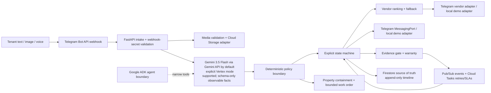

# Architecture

## Trust boundaries

The tenant report, voice transcript, image/audio bytes, vendor callbacks, completion photo, and invoice are untrusted input. The extraction layer can produce facts only. A deterministic policy function consumes validated facts plus trusted property configuration and decides whether a side effect is allowed. State transitions are validated against an allow-list. The timeline stores rule IDs and outcomes, never chain-of-thought. Telegram chat IDs and the under-sink valve instruction are seeded property/vendor data; bot tokens, webhook secrets, and Gemini keys are secrets.

## Persistence and resumption

Firestore stores the serialized `Incident`, embedded timeline, work order, approval, vendor attempts, evidence assessment, and warranty metadata. `processed_events` and `idempotency_keys` are separate Firestore collections. Pub/Sub carries event envelopes with event IDs; Cloud Tasks carries delayed confirmation and retry delivery with stable task names. The startup hook scans non-terminal incidents and re-enqueues/resumes dispatch or delayed confirmation.

The memory repository, local event bus, local task queue, media store, notification adapter, and vendor adapter implement the same ports for deterministic demo and tests. Cloud implementations are lazy-loaded and never needed for local verification.
