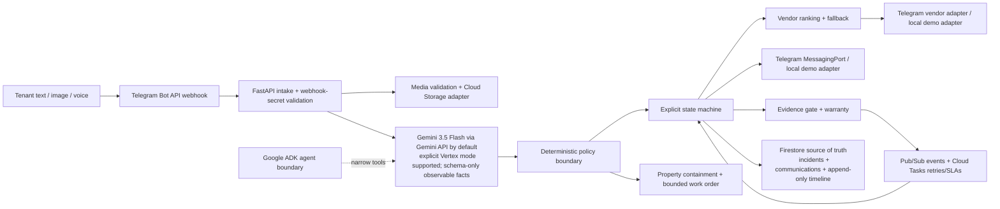

# Architecture

## Trust boundaries

The tenant report, voice transcript, image/audio bytes, vendor callbacks, completion photo, and invoice are untrusted input. The extraction layer can produce facts only. A deterministic policy function consumes validated facts plus trusted property configuration and decides whether a side effect is allowed. State transitions are validated against an allow-list. The timeline stores rule IDs and outcomes, never chain-of-thought. Telegram chat IDs and the under-sink valve instruction are seeded property/vendor data; bot tokens, webhook secrets, and Gemini keys are secrets.

Telegram tenant intake is a persisted draft workflow: `/report` creates one expiring `TelegramDraft`, each text/photo/voice update appends to it, and Submit uses the draft id as the single incident idempotency key. Inline Submit/Add more/Cancel callbacks are authorized against the paired chat and claimed by Telegram `update_id`. A successful draft keeps a short-lived submitted tombstone so repeated Submit taps return the original incident rather than creating another one. Vendor callbacks and typed price/ETA replies use the same deterministic action surface; a completion caption is converted to a bounded invoice plus the attached after-photo and must pass the existing evidence gate.

## Persistence and resumption

Firestore stores the serialized `Incident`, embedded timeline, work order, approval, vendor attempts, evidence assessment, and warranty metadata. `telegram_drafts` stores expiring draft metadata and media references; `communications` is a separate persisted collection keyed by stable communication IDs so duplicate delivery updates one record instead of creating another. `processed_events` and `idempotency_keys` are separate Firestore collections. Pub/Sub carries event envelopes with event IDs; Cloud Tasks carries delayed confirmation prompts and retry delivery with stable task names. The startup hook scans non-terminal incidents and re-enqueues/resumes dispatch or delayed confirmation; a reminder never closes an incident without a tenant response.

Media is stored behind a `MediaStore` port. The API only returns media descriptors and incident-scoped URLs after checking that the asset ID belongs to that incident; it never returns arbitrary GCS paths. The console polls incident, communication, and media endpoints every second for a simple restart-safe live feed.

The memory repository, local event bus, local task queue, media store, notification adapter, and vendor adapter implement the same ports for deterministic demo and tests. Cloud implementations are lazy-loaded and never needed for local verification.
